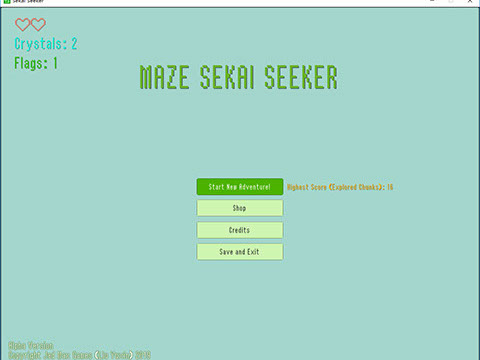
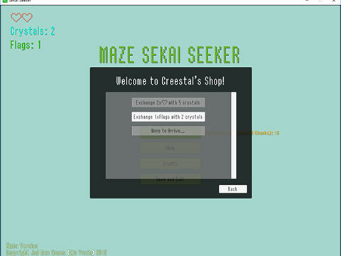
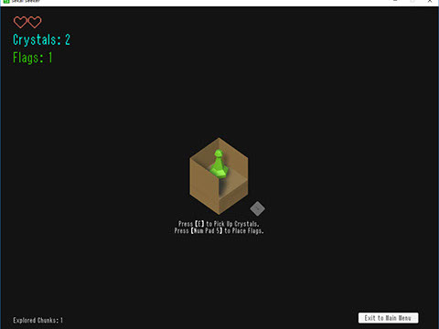
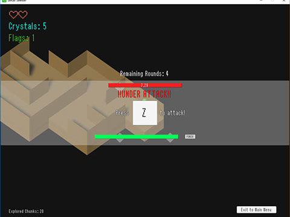

# Maze Sekai Seeker （迷宫探索）

- 走迷宫谁不会啊……

## 啰嗦

浅绿色的棋子，突然鼓起了勇气，越出了棋盘。

土黄色的墙皮，掩盖不了其内深藏的岁月。

多少年前啊，也曾有探索者来到过这。

但他们都不曾踏出迷宫，成了其中的白骨两两。

吸引他们来探索的又是何物？

金银财宝皆不是，唯独那寥寥水晶。

## 操作

- 鼠标点按。

- 当遇上探索者的白骨时，会有数轮攻击。每轮攻击持续时间10s。若超过十秒仍未欧能击溃白骨，则自动视为本轮失败。攻击方式很简单：按照屏幕提示按下相应按键。

- 其共有三种攻击方式：

  1. 迅速地连按按键 (提示信息：“Press...”)；
  2. 在合适的时机按下按键 (提示信息：“Press...”+进度条)；

  3. 长按按键，但会在一定时间内切换按键 (提示信息：“Hold...”)。

- 考验敏捷度！

## 注意

- 游戏有旗帜、水晶两种收集类型的道具。水晶用于购买生命、获取旗帜，可在游戏过程中找到。旗帜可用来照亮道路，使一定范围内的迷宫可视化。旗帜可在攻击白骨时有几率获得。
- 感谢素材提供方 Unity Asset Store！

- 目前版本仍在功能上有所欠缺。若有意见或建议以及游玩过程中出现 Bug ，请及时[联系我](mailto:backerzed@outlook.com)。

## 截图

- 

  [^主菜单]: 主菜单

  

- 

  [^商店]: 简陋的商店

  

- 

  [^游戏内]: 游戏开始

  

- 

  [^游戏内]: 攻击

  

## 版本信息

- Alpha 1
  - 第一个也是最后一个版本……懒得更新……
  - ~~增加了所有的内容~~（废话）

###### [返回主页](index.md)
